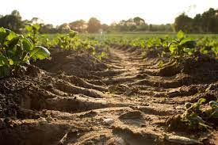
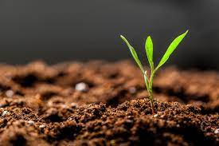
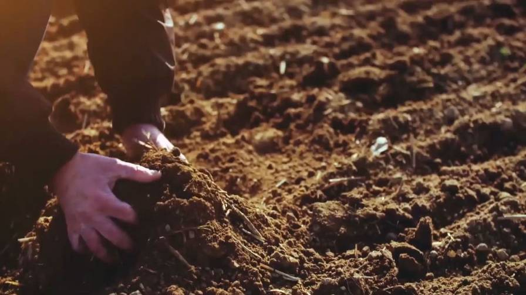
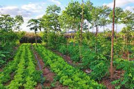

# Introduction

The goal of this project is to predict the soil organic matter content,
and therefore soil quality.

{width="632"}

## Why?

Soil fertility is important because it determines how well crops will
grow, and how much nutritional content there is in the crops produced.
As climate change is disrupting natural nutrient cycling and our soil
quality is worsening due to destructive farming practices, it is
important to understand what factors can improve soil health. Soil is
the basis of our economy as it provides livelihoods for farmers, and the
basis for our health and well-being as it provides us with the food we
need. Through this project, I hope to understand what specific variables
can result in the most fertile soil, therefore helping farmers and
producing healthy crops.

## Goals of this Project

With this project, I hope to explore what factors are most significant
to determining organic matter content in soil based on the best
performing model. With this information, and whether these variables are
negatively correlated or positively correlated with soil organic matter
content, I will be able to determine what factors and their
corresponding magnitudes most affect organic matter content of soil.

## Data used for this Project

Then data used in this project was obtained from Mendeley Data in the
following website: <https://data.mendeley.com/datasets/r7tjn68rmw/1>.
The data set I will be working with includes data on factors that affect
soil fertility in Grevena, a municipality in Northern Greece, where
weather conditions are not optimal for crop output. As a result, soil
organic matter content will not be reflective of other regions where
farming might occur. However, this will provide valuable information on
variables that affect soil health, even in areas not optimal for
agriculture.

```{r setup, include=FALSE}
knitr::opts_chunk$set(echo = TRUE, message = FALSE,
                      warning = FALSE)
```

# Loading and Reading in Data

```{r}
#Load all necessary packages

library(tidyverse)
library(naniar)
library(tidymodels)
library(recipes)
library(modeldata)
library(ISLR)
library(ggplot2)
library(ggpubr)
library(corrplot)
library(ggthemes)
library(janitor)
library(xgboost)
library(ranger)
library(vip)
library(dplyr)
library(readxl)

tidymodels_prefer()

#Assign soil data to a variable
soil <- read.csv("data/soilData.csv")

#Set a seed for reproducibility of experiment
set.seed(100)
```

# Exploring the Raw Data

```{r}
# Call str() to see variable types and number of observations
str(soil)
```

From this, we can see that there are 16 predictor variables all of which
are quantitative, and one response variable (`organic_matter`), which is
quantitative, making our problem regression-based. In addition, there
are 781 observations, making this a sufficiently large data set to run
our models on.

The predictor variables in this data set include: - percent of `Sand`,
`Clay`, and `Silt` in soil - `pH`(ranging from 0-14) - `EC` (electrical
conductivity measured in mS/cm) - `CA_CO3` (the percent of Calcium
Carbonate) - `N_NO3` (the quantity of nitrates measured in parts per
million - ppm) - quantity of major elements in ppm, including `P`, `K`,
and `Mg` - quantity of microelements in ppm (`Fe`, `Zn`,`Mn`, `Cu`, and
`B`), all of which are quantitative variables. Variables that are most
likely to be especially important in predicting oil organic matter
content include the quantity of sand and clay, and the major elements.

```{r}
# Call head() to see the first 6 obseravtions of each variable
head(soil)
```

## Check for Missing Data

Before we begin our exploratory data analysis, it is important to check
for missing data, as it could lead to inaccurate estimates and potential
issues.

```{r}
vis_miss(soil)
```

From the graph above, we can see that 100% of then data is present. In
other words, there is no missing data we have to worry about.

# Exploratory Data Analysis

## Soil Organic Matter

Let's begin by exploring the distribution of the variable we are trying
to predict: organic matter content.

```{r echo=FALSE}
min(soil$organic_matter)
max(soil$organic_matter)

```

```{r}
#Distribution of organic matter
ggplot(soil, aes(organic_matter)) +
  geom_bar(fill='red') +
  labs(
    title = "Distribution of Organic Matter"
  )
```

The range of possible values for `organic_matter` is 0-5 with a minimum
of 0.37 and a maximum of 4.98. The distribution takes on the form of a
right-skewed distribution with values concentrated between 1.5 and 2.5,
suggesting that the most common organic matter content in this region of
Greneva lies between that range.

## Correlation Plot

In order to understand the relationships between the variables, we can
use a correlation plot.

```{r}
soil %>% 
  select(is.numeric) %>% 
  cor() %>% 
  corrplot(type = 'lower', diag = FALSE, 
           method = 'color')
```

Running the correlation plot, we can see that strong positive
correlations include `CACO3` (Calcium Carbonate) and `pH`, `N_NO3`
(Nitrate content) and `EC` (electrical conductivity), `Zn` (Zinc) and
`P` (Phosphorus), and `Mn` (Manganese) and `Fe` (Iron). Strong negative
correlations include `Clay` and `Sand`, `Fe` and `pH`, and `Manganese`
and `pH`. No variables seem to have significant correlations with
`organic_matter`. However, there is a mild negative correlation between
`organic_matter` and `Sand`. This makes sense intuitively because
sandier soils tend to produce less vegetation and crops, suggesting a
lack of organic matter. There is also a mild positive correlation
between organic_matter and Potassium. Since Potassium is a major
element, it would likely have a large impact on soil fertility and
organic matter content.

## Sand, Silt, and Clay

```{r echo=FALSE}
#Plotting Sand vs. Organic Matter
sandPlot <- soil %>% 
  ggplot(aes(x=Sand, y=organic_matter)) + 
  geom_jitter(width = 0.5, size = 0.5) +
  geom_smooth(method = "lm", se =F, col="orange") +
 labs(x="Sand (%)", y="Organic Matter Content")

#Plotting Silt vs. Organic Matter
siltPlot <- soil %>% 
  ggplot(aes(x=Silt, y=organic_matter)) + 
  geom_jitter(width = 0.5, size = 0.5) +
  geom_smooth(method = "lm", se =F, col="brown") +
 labs(x="Silt (%)", y="Organic Matter Content")

#Plotting Clay vs. Organic Matter
clayPlot <- soil %>%   
  ggplot(aes(x=Clay, y=organic_matter)) + 
  geom_jitter(width = 0.5, size = 0.5) +
  geom_smooth(method = "lm", se =F, col="red") +
 labs(x="Clay (%)", y="Organic Matter Content")

fig <- ggarrange(sandPlot, siltPlot, clayPlot,
                    ncol = 3, nrow = 1) 
fig1 <- annotate_figure(fig, top = text_grob("Sand, Silt, and Clay Content vs. Organic Matter", 
               color = "red3", face = "bold", size = 16))
fig1
```

It is clear that the percent of `Sand` present in soil is negatively
related to `organic_matter` content, while percent of `Silt` and `Clay`
present are positively related. However, since the slope of `Clay` is
steeper, it has a greater positive relation with organic matter than
`Silt`. This suggests that an ideal mixture of soil has less sand and
high levels of silt and clay, with a greater presence of clay than silt.

## Major Elements

```{r echo=FALSE}
#Plotting Phosphorus vs. Organic Matter
pPlot <- soil %>% 
  ggplot(aes(x=P, y=organic_matter)) + 
  geom_jitter(width = 0.5, size = 0.5) +
  geom_smooth(method = "lm", se =F, col="red3") +
 labs(x="Phosphorus (ppm)", y="Organic Matter Content")
  
#Plotting Potassium vs. Organic Matter
kPlot <- soil %>% 
  ggplot(aes(x=K, y=organic_matter)) + 
  geom_jitter(width = 0.5, size = 0.5) +
  geom_smooth(method = "lm", se =F, col="darkgreen") +
 labs(x="Potassium (ppm)",y="Organic Matter Content")

#Plotting Magnesium vs. Organic Matter
MgPlot <- soil %>%   
  ggplot(aes(x=Mg, y=organic_matter)) + 
  geom_jitter(width = 0.5, size = 0.5) +
  geom_smooth(method = "lm", se =F, col="grey") +
 labs(x="Magnesium (ppm)",y="Organic Matter Content")
  
fig <- ggarrange(pPlot, kPlot, MgPlot,
                    ncol = 3, nrow = 1) 
fig2 <- annotate_figure(fig, top = text_grob("Major Elements vs. Organic Matter", 
               color = "red3", face = "bold", size = 16))
fig2
```

As we can see from the graphs above comparing major elements present in
soil to the organic matter content, all major elements (Phosphorus,
Potassium, and Magnesium) all have a positive relation with
`organic_matter`, however, at varying levels. Calculating and comparing
slopes, `K` (potassium) has the largest positive slope and therefore the
highest positive correlation with `organic_matter`, followed by `P`
(phosphorus), then `Mg` (magnesium) with a much smaller slope. Thi can
be verified by taking a look at the heat map of the correlation plot.
These results suggest that even within the major elements, certain
elements are more important to the soil health by providing a larger
increase in organic matter.

## Microelements

```{r echo=FALSE}
#Plotting Iron vs. Organic Matter
fePlot <- soil %>% 
  ggplot(aes(x=Fe, y=organic_matter)) + 
  geom_jitter(width = 0.5, size = 0.5) +
  geom_smooth(method = "lm", se =F, col="orange3") +
 labs(x="Iron (ppm)",y="Organic Matter Content")

#Plotting Zinc vs. Organic Matter
znPlot <- soil %>% 
  ggplot(aes(x=Zn, y=organic_matter)) + 
  geom_jitter(width = 0.5, size = 0.5) +
  geom_smooth(method = "lm", se =F, col="lightblue") +
 labs(x="Zinc (ppm)",y="Organic Matter Content")

#Plotting Manganese vs. Organic Matter
MnPlot <- soil %>%   
  ggplot(aes(x=Mn, y=organic_matter)) + 
  geom_jitter(width = 0.5, size = 0.5) +
  geom_smooth(method = "lm", se =F, col="grey") +
 labs(x="Manganese (ppm)",y="Organic Matter Content")

#Plotting Copper vs. Organic Matter
cuPlot <- soil %>% 
  ggplot(aes(x=Cu, y=organic_matter)) + 
  geom_jitter(width = 0.5, size = 0.5) +
  geom_smooth(method = "lm", se =F, col="brown3") +
 labs(x="Copper (ppm)",y="Organic Matter Content")

#Plotting Boron vs. Organic Matter
bPlot <- soil %>%   
  ggplot(aes(x=B, y=organic_matter)) + 
  geom_jitter(width = 0.5, size = 0.5) +
  geom_smooth(method = "lm", se =F, col="darkgreen") +
 labs(x="Boron (ppm)",y="Organic Matter Content")
  
  
fig <- ggarrange(fePlot, znPlot, MnPlot, cuPlot, bPlot,
                    ncol = 3, nrow = 2) 
fig3 <- annotate_figure(fig, top = text_grob("Microelements vs. Organic Matter", 
               color = "red3", face = "bold", size = 16))
fig3
```

Looking at the plots above, we can compare slopes which microelements
are more significantly correlated with `organic_matter`. Once again, we
can take the slopes. We can determine that Iron has the highest positive
correlation, followed by manganese,copper, zinc, then boron. This can be
verified using our correlation plot.

## Electrical Conductivity

```{r echo=FALSE}
ecPlot <- soil %>% 
  ggplot(aes(x=EC, y=organic_matter)) + 
  geom_jitter(width = 0.5, size = 0.5) +
  geom_smooth(method = "lm", se =F, col="purple3") +
 labs(title ="Electrical onductivity vs. Organic Matter", x="EC (mS/cm)",y="Organic Matter Content")
ecPlot
```

Electrical conductivity seems to have a positive correlation with
`organic_matter`, with a slope of about 0.25. This is pretty significant
considering that `EC` ranges from 0 to 1. This means that small changes
in `EC` seem to be associated with large changes in `organic_matter`.

# Set up for Models

Now that we have explored our data, it is time to begin the process of
fitting our models to see if we can actually predict `organic_matter`
using our predictor variables. Before we can begin that process, we need
to split our data into a training and testing set, create folds for
k-fold cross validation, and create a recipe using our predictor
variables.

{width="365"}

## Data Split

To begin with, we want to create a training and testing data set for the
model to be trained on and tested on for performance. The training set
will be used to train our models on, while the testing set will serve as
new data for our models to be tested on. This will allow us to see how
well our model will perform on data it didn't learn on, preventing
overfitting to the training data.

Since we have a large amount of observations, I decided to use a 75/30
split, with 75% of the data used for training and 25% of the data used
for testing. This will increase the model performance, while still
having a decent amount of data left to test on. In order to ensure that
the training and testing data have equal proportions of the outcome
variable, I stratified the split on `organic_matter`.

```{r}
# Set seed for reproducibility
set.seed(100)

# Split the data using a 75/25 split, stratify on organic matter)
soil_split <- initial_split(soil, prop = 0.75, strata = organic_matter)
soil_train <- training(soil_split)
soil_test <- testing(soil_split)
```

## Test Split Accuracy

```{r}
nrow(soil_train)/nrow(soil)
```

Approximately 75% of the data is contained in the training data set, so
it is accurately split.

## Creating the Recipe

Our next step is to create a recipe for the models we decide to fit. The
variables that make up our recipe will include all our predictor
variables which will be used to predict `organic_matter`. The step_dummy
is used to dummy code any categorical variables. In order to normalize
our data we can center and scale all numeric variables. Since all our
variables are numeric, we can run the step_center and step_scale
functions on all our predictor variables.

```{r}
soil_recipe <- recipe(organic_matter ~ Sand + Clay + Silt + pH + EC + CACO3 + N_NO3 + P + K + Mg + Fe + Zn + Mn + Cu + B, data = soil) %>% 
  # dummy coding nominal variables
  step_dummy(all_nominal_predictors()) %>% 
  # normalizing predictors
  step_center(all_predictors()) %>% 
  step_scale(all_predictors())
```

## K-Fold Cross Validation

We will now create 5 folds to be used in the process of k-fold cross
validation. This work by splitting the data into k folds, where each
fold functions as a testing set, and the remaining k-1 folds function as
training sets. This process is repeated with all the folds (each used as
a validation set once) and the average accuracy taken from the testing
across all folds is taken to measure performance. To make sure that the
proportion of our outcome variable among all folds is balanced, we need
to stratify on `organic_matter`.

```{r}
soil_folds <- vfold_cv(soil_train, v = 5, strata = organic_matter)
```

# Build the Models

Now that we have finished setting up, we can begin the process of
building our models. Since some the models require quite a lot of
computing power, I stored them into separate files and loaded them
below. We will be fitting 7 types of models including Ridge, Lasso,
Polynomial regression, K nearest neighbors, Elastic Net, Random Forest
Trees, and Boosted Trees.

## Fit the Models

Each model follows the same structure however with different parameters
and specifications. I have outlines the steps to build the models below.

1.  We first specify the models we want to fit, any parameters that need
    to be tuned, and the engine mode, which will be either
    "classification" or "regression" depending on whether the outcome
    variable is discrete or continuous. The models I specified below are
    the models I am interested in testing the data on: Ridge, Lasso,
    Polynomial regression, K nearest neighbors, Elastic Net, Random
    Forest Trees, and Boosted Trees.

```{r echo=FALSE}
# LINEAR REGRESSION 
lm_mod <- linear_reg() %>% 
  set_engine("lm")

# RIDGE REGRESSION
# Tuning penalty and setting mixture to 0 to specify ridge
ridge_mod <- linear_reg(mixture = 0, 
                         penalty = tune()) %>% 
  set_mode("regression") %>% 
  set_engine("glmnet")

# LASSO REGRESSION
# Tuning penalty and setting mixture to 1 to specify lasso
lasso_mod <- linear_reg(penalty = tune(), 
                         mixture = 1) %>% 
  set_mode("regression") %>% 
  set_engine("glmnet")

# POLYNOMIAL REGRESSION
# Adjusting the recipe because the tuning parameter must be added in the recipe for polynomial regression
# Tuning the degree
poly_rec <- soil_recipe %>% 
  step_poly(Sand, Clay, Silt, pH, EC, CACO3, N_NO3, P, K, Mg, Fe, Zn, Mn, Cu, B, degree = tune())

poly_mod <- linear_reg() %>% 
  set_mode("regression") %>% 
  set_engine("lm")

# K NEAREST NEIGHBORS
# Tuning the number of neighbors
knn_mod <- nearest_neighbor(neighbors = tune()) %>% 
  set_mode("regression") %>% 
  set_engine("kknn")

# ELASTIC NET
# Tuning penalty and mixture
elastic_mod <- linear_reg(penalty = tune(), 
                           mixture = tune()) %>% 
  set_mode("regression") %>% 
  set_engine("glmnet")

# RANDOM FOREST
# Tuning mtry (number of predictors), trees, and min_n (number of minimum values in each node)
rf_mod <- rand_forest(mtry = tune(), 
                       trees = tune(), 
                       min_n = tune()) %>% 
  set_engine("ranger", importance = "impurity") %>% 
  set_mode("regression")

# BOOSTED TREES
# Tuning trees, learn_rate (the learning rate), and min_n
boosted_mod <- boost_tree(trees = tune(),
                           learn_rate = tune(),
                           min_n = tune()) %>%
  set_engine("xgboost") %>%
  set_mode("regression")
```

2.  We then need to set up our workflows for each model by adding the
    model we specified in the previous step as well as our soil_recipe.

```{r echo=FALSE}
# LINEAR REGRESSION 
lm_workflow <- workflow() %>% 
  add_model(lm_mod) %>% 
  add_recipe(soil_recipe)

# RIDGE REGRESSION
ridge_workflow <- workflow() %>% 
  add_recipe(soil_recipe) %>% 
  add_model(ridge_mod)

# LASSO REGRESSION
lasso_workflow <- workflow() %>% 
  add_recipe(soil_recipe) %>% 
  add_model(lasso_mod)

# POLYNOMIAL REGRESSION
poly_workflow <- workflow() %>% 
  add_model(poly_mod) %>% 
  add_recipe(poly_rec)

# K NEAREST NEIGHBORS
knn_workflow <- workflow() %>% 
  add_model(knn_mod) %>% 
  add_recipe(soil_recipe)

# ELASTIC NET
elastic_workflow <- workflow() %>% 
  add_recipe(soil_recipe) %>% 
  add_model(elastic_mod)

# RANDOM FOREST
rf_workflow <- workflow() %>% 
  add_recipe(soil_recipe) %>% 
  add_model(rf_mod)

# BOOSTED TREES
boosted_workflow <- workflow() %>% 
  add_recipe(soil_recipe) %>% 
  add_model(boosted_mod)
```

3.  Once the workflow are created, we need to create a tuning grid in
    order to specify the ranges and number of levels of the parameters
    that will be tuned.

```{r echo=FALSE}
# LINEAR REGRESSION 
#no tuning parameters

# RIDGE REGRESSION
penalty_grid <- grid_regular(penalty(range = c(-5,5)), levels = 50)

# LASSO REGRESSION
# Same  as ridge

# POLYNOMIAL REGRESSION
degree_grid <- grid_regular(degree(range = c(1,5)), levels = 5)

# K NEAREST NEIGHBORS
knn_grid <- grid_regular(neighbors(range = c(1,15)), levels = 5)

# ELASTIC NET
elastic_grid <- grid_regular(penalty(range = c(-5, 5)), mixture(range = c(0,1)), levels = 10)

# RANDOM FOREST
rf_grid <- grid_regular(mtry(range = c(1, 15)), trees(range = c(200,1000)), min_n(range = c(5,20)), levels = 8)

# BOOSTED TREES
boosted_grid <- grid_regular(trees(range = c(5, 200)), learn_rate(range = c(0.01,0.1), trans = identity_trans()), min_n(range = c(40, 60)), levels = 5)
```

The final step to building our models is to tune them by specifying the
workflow, number of folds, and the tuning grid which we have created
above.

```{r eval=FALSE}
# LINEAR REGRESSION 
# No tuning

# RIDGE REGRESSION
ridge_tune <- tune_grid(
  ridge_workflow,
  resamples = soil_folds,
  grid = penalty_grid
)

# LASSO REGRESSION
lasso_tune <- tune_grid(
  lasso_workflow,
  resamples = soil_folds,
  grid = penalty_grid
)

# POLYNOMIAL REGRESSION
poly_tune <- tune_grid(
  poly_workflow,
  resamples = soil_folds,
  grid = degree_grid
)

# K NEAREST NEIGHBORS
knn_tune <- tune_grid(
    knn_workflow,
    resamples = soil_folds,
    grid = knn_grid
)

# ELASTIC NET
elastic_tune <- tune_grid(
  elastic_workflow,
  resamples = soil_folds,
  grid = elastic_grid
)

# RANDOM FOREST
rf_tune <- tune_grid(
  rf_workflow,
  resamples = soil_folds,
  grid = rf_grid
)

# BOOSTED TREES
boosted_tune <- tune_grid(
  boosted_workflow,
  resamples = soil_folds,
  grid = boosted_grid
)
```

## Store and load models

Since Random Forests and Boosted Trees require a lot of computational
power, we will store the tuned models into separate RDS files and load
them back to save time.

```{r eval=FALSE}
# write_rds() to save

# LINEAR REGRESSION 
# No tuning

# RIDGE REGRESSION
write_rds(ridge_tune, file = "scripts/ridge.rds")

# LASSO REGRESSION
write_rds(lasso_tune, file = "scripts/lasso.rds")

# POLYNOMIAL REGRESSION
write_rds(poly_tune, file = "scripts/poly.rds")

# K NEAREST NEIGHBORS
write_rds(knn_tune, file = "scripts/knn.rds")

# ELASTIC NET
write_rds(elastic_tune, file = "scripts/elastic.rds")

# RANDOM FOREST
write_rds(rf_tune, file = "scripts/rf.rds")

# BOOSTED TREES
write_rds(boosted_tune, file = "scripts/boosted.rds")
```

```{r echo=FALSE}
# read_rds() to load back in

# LINEAR REGRESSION 
# No tuning

# RIDGE REGRESSION
ridge_tuned <- read_rds(file = "scripts/ridge.rds")

# LASSO REGRESSION
lasso_tuned <- read_rds(file = "scripts/lasso.rds")

# POLYNOMIAL REGRESSION
poly_tuned <- read_rds(file = "scripts/poly.rds")

# K NEAREST NEIGHBORS
knn_tuned <- read_rds(file = "scripts/knn.rds")

# ELASTIC NET
elastic_tuned <- read_rds(file = "scripts/elastic.rds")

# RANDOM FOREST
rf_tuned <- read_rds(file = "scripts/rf.rds")

# BOOSTED TREES
boosted_tuned <- read_rds(file = "scripts/boosted.rds")
```

## Collect Metrics



Now that our models have been created, stored, and loaded, it is time to
collect metrics in order to compare the results of each model. This can
be done by storing the best model based on RMSE (root mean squared
error) to a variable which will be used later for comparison of the
models. Using the show_best function, we need to slice the results in
order to collect and store only the tope performing results of each
model.

```{r}
lm_fit <- fit_resamples(lm_workflow, resamples = soil_folds)
lm_rmse <- show_best(lm_fit, metric = "rmse")
ridge_rmse <- show_best(ridge_tuned, metric = "rmse")  %>% slice(1)
lasso_rmse <- show_best(lasso_tuned, metric = "rmse")  %>% slice(1)
poly_rmse <- show_best(poly_tuned, metric = "rmse")  %>% slice(1)
knn_rmse <- show_best(knn_tuned, metric = "rmse")  %>% slice(1)
elastic_rmse <- show_best(elastic_tuned, metric = "rmse")  %>% slice(1)
rf_rmse <- show_best(rf_tuned, metric = "rmse")  %>% slice(1)
boosted_rmse <- show_best(boosted_tuned, metric = "rmse")  %>% slice(1)

```

# Model Results

We are now ready to compare our results to determine the best performing
models.

```{r}
# Creating a tibble of all the models and their RMSE
final_compare_tibble <- tibble(Model = c("Linear Regression", "Ridge Regression", "Lasso Regression", "Polynomial Regression", "K Nearest Neighbors", "Elastic Net", "Random Forest", "Boosted Trees"), RMSE = c(lm_rmse$mean, ridge_rmse$mean, lasso_rmse$mean, poly_rmse$mean, knn_rmse$mean, elastic_rmse$mean, rf_rmse$mean, boosted_rmse$mean))

# Arranging by lowest RMSE
final_compare_tibble <- final_compare_tibble %>% 
  arrange(RMSE)

final_compare_tibble
```

We can see that Random Forest was our top performing model with an RMSE
of about 0.473, followed by Boosted Trees with an RMSE of about 0.484.
Ridge Regression and Elastic Net also had performances close to Boosted
Trees and Random Forest, while Polynomial Regression and K Nearest
Neighbors were our worst performing models.

## Autoplots of Models

### Elastic Net

```{r echo=FALSE}
autoplot(elastic_tuned, metric = 'rmse')
  
```

We tuned out both penalty and mixture for our elastic net model. Based
on the plot, the lower the penalty term and the mixture, the better the
performance of our model. A proportion of Lasso Penalty of 0, which is
shown by the orange line, has the lowest RMSE at the lowest value of
mixture.

### Ridge Regression

```{r echo=FALSE}
autoplot(ridge_tuned, metric = 'rmse')
```

For ridge regression, we tuned penalty. Smaller values of penalty seem
to be associated with smaller values of RMSE. It is about the same from
0 to 1 and then exponentially increases suggesting that the best penalty
is below 1.

### Boosted trees

```{r echo=FALSE}
autoplot(boosted_tuned, metric = 'rmse')
```

For boosted trees, we tuned learning rate, number of trees, and minimal
node size each at 5 levels. The model tended to perform a lot worse when
the minimal node size was smaller. The model also performed poorly when
the number of trees was below 50, but tended to average out when it was
greater then 50. In general, a high learning rate causes the model to
learn faster and thus fit better to the training data. However, this
causes overfitting and worse performance on the testing data. The node
size does not seem to have a large impact on the performance. Learning
rate and number of trees seem to have the most impact on model
performance.

### Random Forest

```{r echo=FALSE}
autoplot(rf_tuned, metric = 'rmse')

```

For our random forest model, we tuned the minimal node size, number of
randomly selected predictors, and number of trees.Number of randomly
selected predictors ranges from 1 to 15 where 1 represents the minimum
possible variables to split on and 15 includes all the variables.
However, a model with all 15 variables has the potential for the same
performance for every tree, because all variables are considered for the
initial split every time. This is called bagging. based on the plot, we
can see that the number of trees does not seem to have a significant
difference. The number of randomly selected predictors seems to perform
best between 4 and 8 with performance at its best around 5 or 6 and at
its worst below 3. The number of nodes does not seem to have much of an
effect on the performance. Number of randomly selected predictors seems
to be the tuned parameter that makes the most difference in the model
results.

# Best Model Results

## Boosted Trees

```{r echo=FALSE}
show_best(boosted_tuned, metric = "rmse")  %>% slice(1)
```

Boosted trees was our best performing model. Testing its performance on
the folds, a boosted tree with 151 trees, 45 min_node size, and a
learning rate of 0.055 yielded the best results.

### Fitting to Training Data

We can now take our random forest and boosted tree models and fit them
to our training data. Once this process is complete we can see how it
does on the testing data.

```{r}
# Fitting to the training data
best_boost_train <- select_best(boosted_tuned, metric = 'rmse')
boost_final_workflow_train <- finalize_workflow(boosted_workflow, best_boost_train)
boost_final_train <- fit(boost_final_workflow_train, data = soil_train)

# Save
write_rds(boost_final_train, file = "scripts/boost_final_train.rds")

```

### Testing the Model

```{r echo=FALSE}
# Loading in the training data fit
boost_final_fit_train <- read_rds(file = "scripts/boost_final_train.rds")

# Creating the predicted vs. actual value tibble
soil_tibble <- predict(boost_final_fit_train, new_data = soil_test %>% select(-organic_matter))
soil_tibble <- bind_cols(soil_tibble, soil_test %>% select(organic_matter))

# Save
write_rds(soil_tibble, file = "scripts/final_model.rds")
```

```{r echo=FALSE}
# Load in final model
soil_tibble <- read_rds(file = "scripts/final_model.rds")

# Indicating the desired metric
soil_metric <- metric_set(rmse)

# Collecting the rmse of the model on the testing data
soil_tibble_metrics <- soil_metric(soil_tibble, truth = organic_matter, estimate = .pred)
soil_tibble_metrics
```

The boosted tree actually performed better on the testing set with RMSE
of 0.4694563 which is less than an RMSE of 0.4816195 with the training
set.

## Random Forest

```{r}
show_best(rf_tuned, metric = "rmse")  %>% slice(1)
```

Random Forest was our second-best model. Testing it on the folds, a
random forest with mtry of 5, 667 trees, and 5 minimum nodes resulted in
the best outcome.

### Fitting to Training Data

```{r}
# Fitting to the training data
best_rf_train <- select_best(rf_tuned, metric = 'rmse')
rf_final_workflow_train <- finalize_workflow(rf_workflow, best_rf_train)
rf_final_train <- fit(rf_final_workflow_train, data = soil_train)

# Save
write_rds(rf_final_train, file = "scripts/rf_final_train.rds")
```

### Testing the Model

```{r echo=FALSE}
# Loading in the training data fit
rf_final_fit_train <- read_rds(file = "scripts/rf_final_train.rds")

# Creating the predicted vs. actual value tibble
soil_tibble <- predict(rf_final_fit_train, new_data = soil_test %>% select(-organic_matter))
soil_tibble <- bind_cols(soil_tibble, soil_test %>% select(organic_matter))

# Save
write_rds(soil_tibble, file = "scripts/final_model.rds")
```

```{r echo=FALSE}
# Load in final model
second_soil_tibble <- read_rds(file = "scripts/final_model.rds")

# Indicating the desired metric
second_soil_metric <- metric_set(rmse)

# Collecting the rmse of the model on the testing data
second_soil_tibble_metrics <- second_soil_metric(second_soil_tibble, truth = organic_matter, estimate = .pred)
second_soil_tibble_metrics
```

The random forest model also performed better on the testing set with an
RMSE of 0.4725869 which is less than an RMSE of 0.4831423 with the
training set.

## Variable Importance

Using a variable importance plot (VIP), we can determine which variables
are the most important in predicting our outcome variable
`organic_matter`.

### Boosted trees

Let's take a look at the VIP for Boosted trees.

```{r}
# Loading in the training data fit
boosted_final_fit_train <- read_rds(file = "scripts/boost_final_train.rds")

# Using the training fit to create the VIP because the model was not actually fit to the testing data
boosted_final_fit_train %>% extract_fit_parsnip() %>% 
  vip(aesthetics = list(fill = "blue3", color = "black")) +
  theme_minimal()
```

From this plot, we can see that `K` (Potassium) had the most impact on
the outcome variable by a significant amount with an importance of over
0.3. This was followed by `Sand` and `P` (Phosphorus) with corresponding
importances of just over 0.1 and just under 0.1. `N_NO3` (Nitrate
quantity) was the least important factor in determining the outcome.

### Random Forest

Now, let's create a VIP for the Random Forest model, our second best
model, to compare results.

```{r}
# Loading in the training data fit
rf_final_fit_train <- read_rds(file = "scripts/rf_final_train.rds")

# Using the training fit to create the VIP because the model was not actually fit to the testing scripts
rf_final_fit_train %>% extract_fit_parsnip() %>% 
  vip(aesthetics = list(fill = "blue3", color = "black")) +
  theme_minimal()
```

We can see a clear difference in variable importance between the Boosted
Tree, our best model and Random Forest, our second best model. Potassium
is once again the most important variable . However, it is followed by
Phosphorus as a close second, while the Boosted Tree had Phosphorus as
the third most important variable, with a much lower importance. `Sand`
is the third most important variable. The least important variable seems
to be `Su` Copper, instead of Nitrate quantity.

# Conclusion

After fitting multiple models and running analyses on all of them, we
determined that Boosted Trees was our best performing model, followed by
Random Forest. Since both of these forms are non-parametric, and do not
rely on any previous assumptions, this makes sense. Taking RMSE as the
metric of interest, they both had very low training and testing errors
of less than 0.5.

Our worst performing model was K Nearest Neighbors with an RMSE of just
over 0.5, which makes sense because we had a large quantity of
predictors. The higher the dimensionality, the more the data gets spread
out, which makes it harder to make accurate predictions.

Something I would like to consider in the future would be address
interaction effects. One important effect might occure between Sand,
Silt, and Clay, because each quantity affects the other. I hope that I
can use this information to determine what specific percent affects the
organic_matter.

I also hope to use this data to create a model using unsupervised
learning. This will allow me to determine what variable combinations
will yield the highest outcomes in an instance where we do not already
have the results in front of us. This would be very useful in an
agricultural setting because it would allow farmers to determine how to
improve their soil and increase agricultural output without testing
multiple soil types, which has the potential to be costly and time
consuming. This will also minimize any costs associated with measureing
organic matter content for every soil sample.

Overall, as a I got to know my data better through the process of model
building and testing, I gained a sense of appreciation and understanding
for how much really goes into the production of our food, especially in
a changing climate with so much variability. I was also able to
understand how useful machine learning is, as it allows us to understand
and address such a vast array of issues. Throughout the process of
working on this project, I realized how interesting and applicable these
methods are and I hope to use the knowledge I have gained to make new
discoveries and address important issues in the future.

{width="579"}

# Sources

The data used was taken from a Mendeley dataset in the following
website: <https://data.mendeley.com/datasets/r7tjn68rmw/1>
